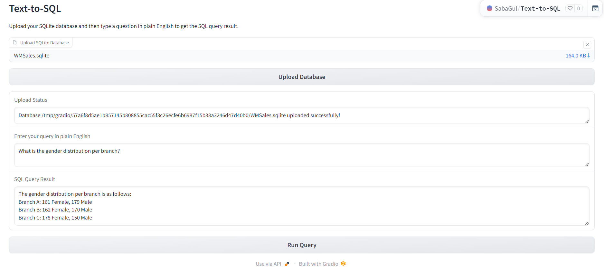

# Text-to-SQL with LangChain and OpenAI

This project is a **Gradio-based web application** that enables users to query an SQLite database using natural language. It uses the **LangChain** framework along with **OpenAI's language models** to translate plain English questions into SQL queries and execute them on the uploaded database.




---

## Features

- **Upload SQLite Database**: Easily upload your own SQLite database file.  
- **Ask in Natural Language**: Type queries in plain English instead of writing SQL.  
- **Instant Results**: View query results directly in the app.  

---

## Installation

To run this application locally, follow these steps:

### 1. Clone the Repository
```bash
git clone https://github.com/pranav-chandrode/Query-sql-data.git
cd Query-sql-data
```

### 2. Create a Virtual Environment
```bash
python -m venv venv
source venv/bin/activate  # On Windows: venv\Scripts\activate
```

### 3. Install Dependencies
```bash
pip install -r requirements.txt
```

### 4. Configure Environment Variables
Create a `.env` file in the project root and add your OpenAI API key:
```
OPENAI_API_KEY=your-openai-api-key
```

### 5. Start the Application
```bash
python app.py
```

---

## Deployment

The app can be deployed on **Hugging Face Spaces** or any platform supporting Python and environment variables.

### Deploying to Hugging Face Spaces

1. **Create a Space**: Visit [Hugging Face Spaces](https://huggingface.co/spaces) and start a new space.  
2. **Add Secrets**: In space settings, add `OPENAI_API_KEY` as a secret with your API key.  
3. **Upload Code**: Push your code to the repository linked with the space.  

---

## Usage

1. **Open the Application**: Go to your Hugging Face Space URL or local server.  
2. **Upload a Database**: Use the upload button to provide an SQLite database.  
3. **Run Queries in English**: Enter a natural language question and click **Run Query** to see results.  

---

## Example Queries

- *"How many rows are in the table?"*  
- *"What is the total revenue by month?"*  
- *"Which product line generated the highest revenue?"*  
- *"Which day of the week has the best average ratings for each branch?"*  

---
